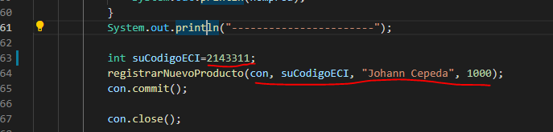

### Escuela Colombiana de Ingeniería
### Ciclos de Vida del desarrollo de Software – CVDS
#### Tecnologías de persistencia - Frameworks de Persistencia - Introducción a MyBatis

### SECCIÓN I. - INTRODUCCIÓN A JDBC

1. Se crea el archivo JDBCExample.java con la configuracion dada por el profesor y seguido de esto se prueba la conexion con la base de datos dbaver:

2. Se elaboran las funciones  y se prueba el funcionamiento de cada una :
	1. valorTotalPedido 
	2. nombresProductosPedido
	
	
	
	3.registrarNuevoProducto : En este punto se registra el producto en la configuracion previa por mediod el siguiente comando:
	
	
	
	revisamos en la DB y efectivamente está creado:
	
	
	
### SECCIÓN II. - INTRODUCCIÓN A MY BATIS	
Base de datos:
	host: desarrollo.is.escuelaing.edu.co
	puerto: 3306
	usuario: bdprueba
	pwd: prueba2019
	base de datos: bdprueba

## Parte I 

1. En el archivo mybatis-config.xml se añadieron los siguientes los siguientes 'typeAliases' con el fin de que se puedan  acceder a éstos de manera mas fácil:

#### 2. Consultar Clientes 
Teniendo esto , se proce a realizar cada uno de los mappers teniendo encuenta las relaciones de cada una de las tablas , y probamos cómo a través del 'mapper' generado por MyBatis, se puede consultar todos los clientes

## Parte II

#### 3. Consultar CLiente
De igual forma , probamos con el funcionamiento con el fin de conocer si retorna resultados para un cliente en especifico , y los resultados fueron los siguiente:

#### 5. Agregar Item rentado a cliente (creacion e insercion de item, tipo item e itemRentado) :

	
Para el item rentado primero se procedió
a crear tipo Item

Verificamos que se encuentre tipoitem en la DB :
	

	
Insertamos el item y verificamos en la DB:
	

	
Por ultimo  , con el item rentado  verificamos que se haya creado correctamente :
	

	
#### 6. Consultar item rentado a cliente 

#### 7. Consultar Items y Consultar Item

